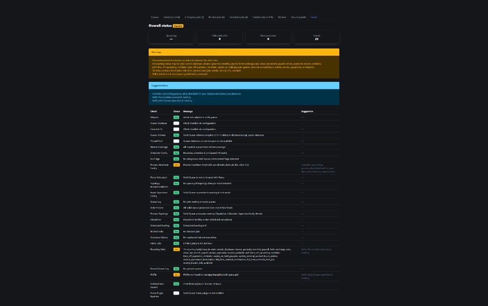

<p align="center">
  
  
  
  
  
</p>

<h1 align="center">solid_queue_guard</h1>

<p align="center">
  <strong>Your Solid Queue production doctor.</strong><br>
  Catch dead workers, queue lag, and broken config <em>before</em> the 3am page.
</p>

<p align="center">
  <a href="#-quick-start"><strong>Quick start</strong></a> ·
  <a href="docs/checks.md"><strong>Checks</strong></a> ·
  <a href="docs/configuration.md"><strong>Configuration</strong></a> ·
  <a href="#-mission-control-dashboard"><strong>Mission Control</strong></a>
</p>

---

Rails 8 ships with [Solid Queue](https://github.com/rails/solid_queue). Redis is optional. **Production config is not.**

Your web tier can be **green** while your jobs are **dead**. **solid_queue_guard** catches that *before* it becomes an incident.

> **Mission Control** shows what is happening.  
> **solid_queue_guard** warns what is dangerous.

### Install in 30 seconds

```bash
bundle add solid_queue_guard
bin/rails solid_queue_guard:install
bin/rails solid_queue_guard:doctor
```

---

## Why this exists

| Symptom | What actually happened |
| ------- | ---------------------- |
| "Site is up, emails stopped" | Workers dead, heartbeats stale |
| "Only 3 jobs in the queue, why the panic?" | Oldest job waiting 40 minutes — **lag**, not depth |
| "Recurring billing just… stopped" | Scheduler not running |
| "Jobs hang after deploy" | Thread count > DB pool |
| "Health check passes, jobs don't" | `/up` doesn't know Solid Queue exists |

---

## 👨‍⚕️ See it in action

```text
SolidQueueGuard Report

Status: DEGRADED

Checks:
✅ Active Job adapter is :solid_queue
❌ Worker threads: 10, queue DB pool: 5
⚠️ No workers configured for "mailers" queue

Suggested fixes:
- Increase queue DB pool to at least 12 or reduce worker threads
```

**One command. Actionable output. No Datadog required to get started.**

Full check list: [docs/checks.md](docs/checks.md)

---

## 🚀 Quick start

```bash
bundle add solid_queue_guard
bin/rails solid_queue_guard:install
bin/rails solid_queue_guard:doctor
SOLID_QUEUE_GUARD_STRICT=1 bin/rails solid_queue_guard:doctor   # CI gate
bin/rails solid_queue_guard:report                              # config + runtime
```

```ruby
# config/routes.rb
mount SolidQueueGuard::Engine, at: "/solid_queue_guard"
```

```bash
curl localhost:3000/solid_queue_guard/health
```

All configuration options: [docs/configuration.md](docs/configuration.md)

### Operational surfaces

| Surface | Command / URL | Best for |
| ------- | ------------- | -------- |
| **Doctor** | `bin/rails solid_queue_guard:doctor` | Local pre-deploy, config review |
| **CI gate** | `SOLID_QUEUE_GUARD_STRICT=1 bin/rails solid_queue_guard:doctor` | Block bad merges |
| **HTTP health** | `GET /solid_queue_guard/health` | Kamal, ECS, K8s, UptimeRobot |
| **Guard tab** | `GET …/applications/:application_id/guard` | Human checks in Mission Control |

---

## 🛡️ Mission Control dashboard

Opt-in **Guard** tab for [Mission Control — Jobs](https://github.com/rails/mission_control-jobs):

```ruby
gem "mission_control-jobs"

SolidQueueGuard.configure { |config| config.integrate_mission_control = true }

mount MissionControl::Jobs::Engine, at: "/jobs"
mount SolidQueueGuard::Engine, at: "/solid_queue_guard"
```



Requires `mission_control-jobs` and an asset pipeline (Propshaft or Sprockets). Load balancers should keep using `/solid_queue_guard/health`.

---

## Public API (v1.0+)

Stable until `2.0` — [semantic versioning](https://semver.org/):

| API | Description |
| --- | ----------- |
| `SolidQueueGuard.configure` | Block-style configuration |
| `solid_queue_guard:doctor` | Config readiness report |
| `solid_queue_guard:report` | Full diagnostic report |
| `mount SolidQueueGuard::Engine` | HTTP health endpoint |
| `config.integrate_mission_control` | Guard tab (requires `mission_control-jobs`) |

Internal check classes and registry are `@api private`.

---

## ⚔️ vs Mission Control

| | Mission Control | solid_queue_guard |
| --- | --- | --- |
| **Purpose** | Inspect & manage jobs | Detect production risk |
| **Config doctor** | No | Yes |
| **Pre-deploy checks** | No | Yes |
| **Queue lag alerts** | No | Yes |

**Use both.**

---

## Compatibility

| Gem version | Ruby | Rails |
| ----------- | ---- | ----- |
| 1.2.x       | 3.1+ | 7.1, 7.2, 8.0 |
| 1.1.x       | 3.1+ | 7.1, 7.2, 8.0 |
| 1.0.x       | 3.1+ | 7.1, 7.2, 8.0 |

- [solid_queue](https://github.com/rails/solid_queue) >= 1.0, < 2.0
- [mission_control-jobs](https://github.com/rails/mission_control-jobs) — optional

---

## Development

See [CONTRIBUTING.md](CONTRIBUTING.md) for setup, `bin/console`, Appraisal matrix, and `script/validate_revelo.sh`.

```bash
bundle exec rake test
bundle exec rubocop
bundle exec appraisal rake test
gem build solid_queue_guard.gemspec
```

---

## License

MIT — see [MIT-LICENSE](MIT-LICENSE).

---

<p align="center">
  <strong>Run the doctor before you run the deploy.</strong><br>
  <sub>Built for Rails teams who chose Solid Queue and still sleep at night.</sub>
</p>
