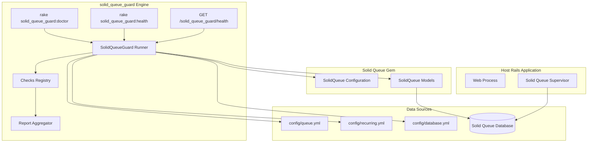

# TDD — solid_queue_guard

| Field           | Value                                      |
| --------------- | ------------------------------------------ |
| Tech Lead       | @rpissardo                                 |
| Product Manager | N/A (open source library)                  |
| Team            | @rpissardo (solo OSS project)              |
| Epic/Ticket     | N/A                                        |
| Repository      | https://github.com/rafael-pissardo/solid_queue_guard |
| Status          | Draft                                      |
| Created         | 2026-07-09                                 |
| Last Updated    | 2026-07-09                                 |

---

## Context

Solid Queue is the default Active Job backend in Rails 8, replacing Redis-backed systems with a database-backed approach. While this simplifies infrastructure for small and medium SaaS teams, it introduces new operational risks: misconfigured worker threads vs database connection pools, silent recurring job failures, dead worker processes with a healthy web tier, and queue lag that is invisible until it becomes an incident.

Mission Control — Jobs provides operational visibility (inspect queues, retry/discard failed jobs) but does not proactively detect production readiness risks or surface degraded runtime conditions suitable for deploy healthchecks and uptime monitoring.

**solid_queue_guard** is an open source Rails gem that answers: *"Is my Solid Queue configuration safe for production, and is the runtime healthy?"* It complements Mission Control rather than competing with it.

**Background**: Rails teams adopting Solid Queue — especially those migrating from Sidekiq or GoodJob, deploying with Kamal, Heroku, ECS/Fargate, Fly.io, or VPS — lack lightweight SRE tooling tailored to Solid Queue's process model (supervisor, workers, dispatchers, scheduler) and separate queue database.

**Domain**: Background job infrastructure, production observability, Rails platform tooling.

**Stakeholders**: Rails developers, SRE/platform engineers, small/medium SaaS operators, open source community.

---

## Problem Statement & Motivation

### Problems We're Solving

- **Unsafe production configuration goes undetected**
  - Impact: Worker thread count exceeding queue database pool size causes connection starvation, job processing stalls, and intermittent failures. Solid Queue documentation recommends `pool >= max(threads) + 2`, but teams routinely misconfigure this.

- **Operational failures are silent**
  - Impact: Web tier appears healthy while workers, dispatchers, or schedulers are dead. Recurring jobs (billing sync, reports, cleanup) stop without alerts until business impact occurs (missed invoices, stale data).

- **Queue depth is a misleading health signal**
  - Impact: A queue with hundreds of jobs may be healthy if draining quickly; a queue with three jobs may be critical if no worker has claimed them for 40 minutes. Teams lack queue **lag** (oldest waiting job age) as a first-class metric.

- **No deploy-ready healthcheck for Solid Queue**
  - Impact: Kamal, ECS, Kubernetes, and uptime tools cannot easily verify job infrastructure health. Teams either skip job healthchecks or build ad-hoc scripts per application.

### Why Now?

- **Business driver**: Rails 8 adoption accelerates Solid Queue as the default; teams want Redis-free production stacks.
- **Technical driver**: Solid Queue's multi-process architecture (supervisor, workers, dispatchers, scheduler) and separate queue database require domain-specific guardrails that generic APM does not provide out of the box.
- **User driver**: Developers migrating from Sidekiq expect operational tooling; Solid Queue's ecosystem gap creates friction.

### Impact of NOT Solving

- **Business**: Delayed emails, missed billing cycles, stale synchronizations — discovered days or weeks later.
- **Technical**: Incident response relies on manual DB queries and tribal knowledge; each team reinvents health scripts.
- **Users**: Degraded experience (slow notifications, stuck workflows) while the application appears online.

---

## Scope

### In Scope (V1 — v0.1.0)

- Rails engine gem published to rubygems.org (MIT license)
- Pluggable check framework with aggregated report (`healthy` / `degraded` / `unhealthy`)
- Configuration checks via `solid_queue_guard:doctor` rake task:
  - Active Job adapter verification
  - Queue database configuration
  - Queue schema presence
  - Thread pool vs database pool sizing (queue DB pool via `connects_to`, not primary)
  - Worker coverage for configured queues
  - Scheduler configuration vs recurring tasks
  - Dangerous environment flags in production
  - Process heartbeat threshold awareness
  - Puma co-located mode warning in production
  - CLI flags: `--format=json`, `--strict` (CI mode: exit 1 on warn)
- Terminal report formatter with actionable suggestions
- Install generator producing initializer template
- Architecture scaffold for v0.2–v0.5 (runtime checks, health endpoint, notifiers, metrics) without implementing them
- Test suite with dummy Rails app (Minitest + Appraisal for Rails 7.1 / 8.0)

### Out of Scope (V1)

- Web dashboard or UI (Mission Control owns inspection)
- Dedicated database tables for the gem
- Redis or external state store
- Job retry/discard management
- Auto-remediation (scaling workers, restarting processes)
- Multi-tenant or multi-cluster federation
- Commercial support or hosted service

### Future Considerations (V2+)

| Version | Capabilities |
| ------- | ------------ |
| v0.2 | Runtime health JSON endpoint, queue lag, stale processes, **dispatcher health**, **scheduled backlog**, **blocked jobs**, orphaned claims, failed jobs, recurring staleness, **pidfile check**, **finished jobs growth**, **health cache**, **Rails `/up` integration** |
| v0.3 | Notification adapters (Slack, Datadog, webhook) |
| v0.4 | Metrics export (StatsD, Prometheus, OpenTelemetry) |
| v0.5 | Auto-recommendations for `queue.yml` topology |

### Additional Capabilities (rails-fullstack-tdd review)

Capabilities identified during plan review that address real production gaps not covered by Mission Control or generic APM:

| Capability | Problem Solved | Version |
| ---------- | -------------- | ------- |
| **Dispatcher health** | Scheduled jobs never become ready when dispatcher is dead; queue appears empty | v0.2 |
| **Scheduled backlog** | `ScheduledExecution.due` grows silently while ready queues stay empty | v0.2 |
| **Blocked jobs** | Concurrency-blocked jobs invisible to lag and failed-job metrics | v0.2 |
| **CI strict mode** | Deploy pipelines need to fail on warnings, not only hard failures | v0.1 |
| **JSON doctor output** | Scripting and CI without HTTP endpoint dependency | v0.1 |
| **Puma co-located warning** | Running Solid Queue inside web process risks memory and isolation | v0.1 |
| **`connects_to` validation** | Pool sizing must target queue DB, not primary application DB | v0.1 |
| **Supervisor pidfile check** | Lightweight liveness when pidfile is configured | v0.2 |
| **Finished jobs growth** | `preserve_finished_jobs` without cleanup recurring task causes table bloat | v0.2 |
| **Health endpoint cache** | Frequent uptime polls hammering queue database | v0.2 |
| **Rails `/up` integration** | Single health URL for Kamal/ECS instead of separate mount | v0.2 |

---

## Technical Solution

### Architecture Overview

solid_queue_guard is a Rails engine that reads Solid Queue configuration files and (when available) queries the Solid Queue database via `SolidQueue::Record`. It runs a registry of independent checks, aggregates results into a report, and exposes them through CLI rake tasks and (v0.2+) an optional HTTP health endpoint.

**Key Components**:

| Component | Responsibility |
| --------- | -------------- |
| `Configuration` | Thresholds, enabled flag, notification adapters, health token |
| `Checks::Registry` | Registers checks by scope (`:config`, `:runtime`) |
| `Runner` | Executes checks, handles individual failures gracefully |
| `Report` | Aggregates check results into overall status |
| `Checks::Config::*` | Static configuration analysis (v0.1) |
| `Checks::Runtime::*` | Database-backed runtime analysis (v0.2) |
| `Notifiers::*` | Alert delivery adapters (v0.3) |
| `Engine` | Mountable routes for HTTP health (v0.2) |

**Positioning vs Mission Control**:

| Tool | Role |
| ---- | ---- |
| Mission Control — Jobs | Shows what is happening (inspect, retry, discard) |
| solid_queue_guard | Warns what is dangerous (pre-incident detection, deploy health) |

### Architecture Diagram



### Data Flow

1. **Trigger**: Developer runs `doctor` locally, CI runs `doctor` on deploy, or uptime monitor hits `/solid_queue_guard/health`.
2. **Configuration load**: Runner reads gem configuration and determines which check scopes to execute.
3. **Config checks**: Parse `queue.yml`, `recurring.yml`, `database.yml`; validate via `SolidQueue::Configuration` where applicable. No database required.
4. **Runtime checks** (v0.2+): Query `SolidQueue::Record` connection for process heartbeats, queue lag, failed jobs, recurring task staleness.
5. **Aggregation**: Each check returns a `Result` (pass/warn/fail/skip). Report computes overall status.
6. **Output**: Terminal formatter, JSON payload, or HTTP response with appropriate status code.

### Check Result Contract

Every check produces a standardized result:

| Field | Type | Description |
| ----- | ---- | ----------- |
| `id` | string | Stable identifier (e.g., `thread_pool`, `queue_lag_critical`) |
| `status` | enum | `pass`, `warn`, `fail`, `skip` |
| `message` | string | Human-readable finding |
| `suggestion` | string (optional) | Actionable remediation |
| `metadata` | object (optional) | Structured context for JSON/metrics export |

**Overall status aggregation**:

| Condition | Overall Status |
| --------- | -------------- |
| Zero `fail` results | `healthy` if zero `warn`; otherwise `degraded` |
| One or more `fail` results | `unhealthy` |

### APIs & Endpoints

#### CLI Tasks

| Task | Description | Output | Exit Code |
| ---- | ----------- | ------ | --------- |
| `solid_queue_guard:install` | Generates initializer | Files created | 0 |
| `solid_queue_guard:doctor` | Full diagnostic report | Terminal (colorized) or JSON | 0 if healthy/degraded; 1 if unhealthy |
| `solid_queue_guard:doctor --strict` | CI mode: fail on warnings too | Terminal or JSON | 0 only if all pass; 1 on warn or fail |
| `solid_queue_guard:doctor --format=json` | Machine-readable doctor output | JSON | Same as doctor |
| `solid_queue_guard:health` | Machine-readable status | JSON | Same as doctor |
| `solid_queue_guard:report` | Detailed report | Terminal + JSON option | Same as doctor |

**Environment variables**:

| Variable | Effect |
| -------- | ------ |
| `SOLID_QUEUE_GUARD_STRICT=1` | Equivalent to `--strict` |

#### HTTP Health Endpoint (v0.2)

| Endpoint | Method | Description |
| -------- | ------ | ----------- |
| `/solid_queue_guard/health` | GET | Runtime health status |

**Request**: Optional header `X-Solid-Queue-Guard-Token` when `health_token` is configured.

**Response schema**:

```json
{
  "status": "degraded",
  "queue_lag_seconds": 245,
  "failed_jobs_last_hour": 17,
  "dead_processes": 1,
  "checks": [
    {
      "id": "queue_lag_mailers",
      "status": "fail",
      "message": "mailers queue lag is 22 minutes",
      "suggestion": "Add a worker for the mailers queue"
    }
  ],
  "warnings": [
    "critical queue lag is above threshold",
    "one worker heartbeat is stale"
  ]
}
```

**HTTP status codes**:

| Overall Status | HTTP Code |
| -------------- | --------- |
| `healthy` | 200 |
| `degraded` | 200 |
| `unhealthy` | 503 |

### Configuration Contract

Host application initializer (generated by install):

| Setting | Type | Default | Description |
| ------- | ---- | ------- | ----------- |
| `enabled` | boolean | `true` in production | Master switch |
| `queue_lag_thresholds` | hash | `{ default: 5.minutes }` | Per-queue lag limits |
| `failed_jobs_threshold` | integer | 20 | Max failed jobs per hour before warn |
| `stale_process_threshold` | duration | 5.minutes | Stale heartbeat detection |
| `health_token` | string (optional) | nil | Protects HTTP endpoint |
| `strict_mode` | boolean | false | Treat warnings as failures (exit code 1) |
| `health_cache_ttl` | duration | 15.seconds | Cache health results to reduce queue DB load (v0.2) |
| `scheduled_backlog_threshold` | integer | 100 | Max due scheduled executions before warn (v0.2) |
| `integrate_rails_health` | boolean | false | Compose status into `rails/health#show` (v0.2) |
| `notify_with` | array | `[:rails_logger]` | Notification adapters (v0.3) |

### Database Changes

**None.** solid_queue_guard does not create or modify any database tables. All runtime queries read from Solid Queue's existing schema (`solid_queue_jobs`, `solid_queue_processes`, `solid_queue_ready_executions`, etc.) via `SolidQueue::Record.connection`.

### Runtime Data Sources (Read-Only)

| Solid Queue Table | Guard Usage |
| ----------------- | ----------- |
| `solid_queue_ready_executions` | Queue lag (`MIN(created_at)` per queue) |
| `solid_queue_processes` | Heartbeat staleness, process topology |
| `solid_queue_failed_executions` | Failed job pressure |
| `solid_queue_recurring_executions` | Recurring task staleness |
| `solid_queue_claimed_executions` | Orphaned in-flight jobs |
| `solid_queue_blocked_executions` | Concurrency-blocked jobs (stuck detection) |
| `solid_queue_scheduled_executions` | Due scheduled backlog (dispatcher health) |
| `solid_queue_pauses` | Paused queue with growing lag |

---

## Risks

| Risk | Impact | Probability | Mitigation |
| ---- | ------ | ----------- | ---------- |
| False positives on heartbeat checks | Medium | Medium | Account for `process_alive_threshold + process_heartbeat_interval`; document defaults; allow threshold customization |
| Health endpoint exposes operational data | High | Low | Optional token auth; mount behind reverse proxy; document not to expose publicly without protection |
| Query load on queue database from frequent health polls | Medium | Medium | Cache health results briefly; use indexed queries only; document recommended poll interval (30–60s) |
| Solid Queue internal API changes between versions | Medium | Medium | Pin minimum `solid_queue >= 1.0`; Appraisal matrix; integration tests against multiple versions |
| `doctor` gives false confidence when DB unavailable | Medium | Medium | Clearly mark DB-dependent checks as `skip`; document offline vs online modes |
| Scope creep into dashboard territory | Low | High | Strict positioning vs Mission Control; reject UI features in scope reviews |
| Gem not adopted due to crowded ecosystem | Medium | Medium | Focus on unique value (pre-incident, deploy health); publish early v0.1 with `doctor` only |

---

## Implementation Plan

| Phase | Task | Description | Owner | Status | Estimate |
| ----- | ---- | ----------- | ----- | ------ | -------- |
| **Phase 0 — Bootstrap** | Repository setup | Gemspec, engine, Zeitwerk, MIT license, CI | @rpissardo | TODO | 1d |
| | Check framework | Base, Result, Registry, Runner, Report | @rpissardo | TODO | 1d |
| **Phase 1 — v0.1 Doctor** | Config checks (10) | Adapter, DB, connects_to, schema, thread pool, worker coverage, scheduler, env flags, heartbeat config, puma co-located | @rpissardo | TODO | 2.5d |
| | CLI enhancements | `--format=json`, `--strict`, `SOLID_QUEUE_GUARD_STRICT` | @rpissardo | TODO | 0.5d |
| | Rake tasks | doctor, health, report with formatters and exit codes | @rpissardo | TODO | 0.5d |
| | Install generator | Initializer template | @rpissardo | TODO | 0.5d |
| **Phase 2 — Scaffold** | v0.2 stubs | Runtime checks, HealthController returning 501 | @rpissardo | TODO | 0.5d |
| | v0.3+ stubs | Notifier and metrics interfaces | @rpissardo | TODO | 0.5d |
| **Phase 3 — Testing** | Dummy app + tests | Minitest per check; Appraisal for Rails 7.1/8.0 | @rpissardo | TODO | 2d |
| **Phase 4 — Release** | README + publish | Documentation, rubygems.org v0.1.0 | @rpissardo | TODO | 1d |
| **Phase 5 — v0.2** | Runtime health | Queue lag, stale processes, dispatcher, scheduled backlog, blocked jobs, HTTP endpoint, health cache, Rails `/up` integration | @rpissardo | TODO | 4d |
| **Phase 6 — v0.3** | Alerting | Slack, Datadog, webhook notifiers | @rpissardo | TODO | 2d |
| **Phase 7 — v0.4** | Metrics export | StatsD, Prometheus, OpenTelemetry | @rpissardo | TODO | 2d |
| **Phase 8 — v0.5** | Recommendations | Worker topology suggestions | @rpissardo | TODO | 2d |

**Total Estimate (v0.1 release)**: ~10 days

**Total Estimate (v0.1–v0.5)**: ~20 days

---

## Security Considerations

### Authentication & Authorization

- **HTTP health endpoint** (v0.2): Optional shared-secret token via `X-Solid-Queue-Guard-Token` header. When configured, requests without valid token receive `401 Unauthorized`.
- **Recommended deployment**: Mount engine on internal network only, or behind load balancer with IP allowlisting. Do not expose health endpoint to public internet without token protection.
- **CLI tasks**: No authentication required (run in deploy context with existing access controls).

### Data Protection

- **Read-only access**: Gem only reads Solid Queue tables; never writes, modifies, or deletes job data.
- **No PII collection**: Check results may include queue names and job counts but must not include job arguments, which may contain user data.
- **Secrets**: Webhook URLs and API tokens (v0.3) stored in environment variables or Rails credentials, never logged.

### Information Disclosure

Health responses expose operational metadata (queue names, process counts, lag seconds). Acceptable for internal monitoring; document risk if endpoint is publicly accessible.

---

## Testing Strategy

| Test Type | Scope | Coverage Target | Approach |
| --------- | ----- | --------------- | -------- |
| **Unit Tests** | Individual checks, Report aggregation | All checks | Minitest with stubbed config files |
| **Integration Tests** | Runner with dummy Rails app | Critical paths | Dummy app with Solid Queue schema |
| **Appraisal Tests** | Rails 7.1, 8.0 compatibility | CI matrix | Appraisal gemfiles |

### Critical Test Scenarios

**Configuration checks (v0.1)**:

- Thread pool 5 with worker threads 10 → `fail` with suggestion to increase pool to 12
- Active Job adapter not `:solid_queue` → `fail`
- `recurring.yml` present but `SOLID_QUEUE_SKIP_RECURRING=true` in production → `warn`
- Queue database entry missing from `database.yml` → `fail`
- `connects_to` misconfigured (pool read from primary instead of queue) → `fail`
- Puma Solid Queue plugin enabled in production → `warn`
- Worker config does not cover queue used in `recurring.yml` → `fail`
- `--strict` with warnings only → exit code 1
- `--format=json` output matches result contract schema

**Runtime checks (v0.2)**:

- Dispatcher not alive with `ScheduledExecution.due.count > threshold` → `unhealthy`
- Expired blocked executions not released → `degraded` or `unhealthy`
- Orphaned claimed executions present → `degraded`
- Health endpoint returns cached result within TTL (no duplicate queries)
- Finished jobs table growing without cleanup recurring task → `warn`

**Report aggregation**:

- All pass → `healthy`
- Warnings only → `degraded`
- Any fail → `unhealthy`
- DB unavailable → runtime checks return `skip`, config checks still run

**HTTP endpoint (v0.2)**:

- Valid token → 200/503 based on status
- Invalid/missing token when configured → 401
- Response matches JSON schema

---

## Monitoring & Observability

### Metrics to Export (v0.4)

| Metric | Type | Description |
| ------ | ---- | ----------- |
| `solid_queue.guard.queue_lag` | Gauge | Oldest ready job age per queue (seconds) |
| `solid_queue.guard.failed_jobs` | Counter | Failed jobs in rolling window |
| `solid_queue.guard.ready_jobs` | Gauge | Ready execution count per queue |
| `solid_queue.guard.blocked_jobs` | Gauge | Concurrency-blocked jobs |
| `solid_queue.guard.stale_processes` | Gauge | Processes past heartbeat threshold |
| `solid_queue.guard.overall_status` | Gauge | 0=healthy, 1=degraded, 2=unhealthy |

### Structured Logging

Guard operations log in JSON-compatible format:

| Field | Description |
| ----- | ----------- |
| `check_id` | Which check ran |
| `status` | pass/warn/fail/skip |
| `duration_ms` | Check execution time |
| `overall_status` | Aggregated result |

**Do not log**: job arguments, webhook URLs, API tokens.

### Alert Thresholds (v0.3 Defaults)

| Condition | Severity | Suggested Action |
| --------- | -------- | ---------------- |
| Any queue lag exceeds configured threshold | High | Investigate worker coverage and throughput |
| Stale worker heartbeat | Critical | Restart job supervisor; check process health |
| Scheduler not running with recurring tasks configured | High | Verify scheduler process; check `SOLID_QUEUE_SKIP_RECURRING` |
| Failed jobs exceed threshold in 1 hour | Medium | Review failed job errors in Mission Control |
| Thread pool misconfiguration detected | High | Fix before next deploy (`doctor` in CI) |

### Integration Points

| Platform | Integration |
| -------- | ----------- |
| Kamal / ECS / K8s | HTTP health endpoint in deploy healthcheck |
| UptimeRobot / Better Stack | Synthetic GET on `/solid_queue_guard/health` |
| Datadog | Notification adapter (v0.3) + metric export (v0.4) |
| CI pipeline | `doctor` task with exit code 1 on unhealthy |

---

## Rollback Plan

### Deployment Strategy

solid_queue_guard is an additive gem with no database migrations and no modifications to host application data.

| Phase | Action |
| ----- | ------ |
| v0.1 | Add gem to Gemfile; run `doctor` locally and in CI |
| v0.2 | Optionally mount health endpoint; configure uptime checks |
| v0.3 | Enable notification adapters one at a time |

### Rollback Triggers

| Trigger | Action |
| ------- | ------ |
| Health endpoint causes unexpected load on queue DB | Remove mount from routes; increase poll interval |
| False positive alerts disrupt on-call | Disable notifications; adjust thresholds; remove gem temporarily |
| Gem version introduces regression | Pin to previous gem version in Gemfile |

### Rollback Steps

1. **Remove gem**: Delete from Gemfile, run bundle install, remove engine mount from routes.
2. **Disable notifications** (v0.3): Set `notify_with: []` in initializer without removing gem.
3. **Disable HTTP endpoint**: Remove engine mount; CLI tasks remain available.
4. **Verify**: Confirm host application and Solid Queue operate normally without guard.

No database rollback required. No data migration to reverse.

---

## Success Metrics

| Metric | Baseline | Target | Measurement |
| ------ | -------- | ------ | ----------- |
| rubygems.org downloads (30 days post v0.1) | 0 | 500+ | rubygems stats |
| GitHub stars (90 days) | 0 | 100+ | GitHub |
| `doctor` catches misconfiguration before deploy | N/A | Documented case studies | Issues/discussions |
| False positive rate on heartbeat checks | N/A | < 5% | Maintainer feedback |
| Time to first useful output after install | N/A | < 2 minutes | README quickstart |
| Rails version compatibility | N/A | 7.1, 8.0 tested | Appraisal CI green |

**Adoption signals**:

- Referenced in Rails community discussions (Reddit, Ruby Weekly)
- Used in at least 3 production deployments (self-reported)
- No critical security issues in first 90 days

---

## Glossary

| Term | Description |
| ---- | ----------- |
| **Queue lag** | Time the oldest ready job has been waiting for a worker (seconds) |
| **Stale process** | Solid Queue process whose `last_heartbeat_at` exceeds the alive threshold |
| **Supervisor** | Solid Queue process that manages workers, dispatchers, and scheduler |
| **Dispatcher** | Moves scheduled jobs to ready state when due; distinct failure mode from workers |
| **Scheduled backlog** | Jobs past `scheduled_at` waiting for dispatcher to move to ready |
| **Blocked execution** | Job held by concurrency control until semaphore expires or is released |
| **Scheduler** | Enqueues recurring tasks from `recurring.yml` |
| **Ready execution** | Job waiting in queue for a worker to claim |
| **Claimed execution** | Job currently being processed by a worker |
| **Recurring task** | Scheduled job defined in `recurring.yml` or registered dynamically |
| **Degraded** | System operational but with warnings requiring attention |
| **Doctor** | CLI diagnostic command for configuration and runtime analysis |

---

## Alternatives Considered

| Option | Pros | Cons | Decision |
| ------ | ---- | ---- | -------- |
| **solid_queue_guard** (chosen) | Domain-specific; lightweight; complements Mission Control; no Redis | New gem to maintain; requires adoption | **Chosen** — fills clear gap |
| Mission Control — Jobs only | Official; full UI; retry/discard | Reactive, not proactive; no deploy healthcheck; no config doctor | Use alongside guard, not instead |
| Custom per-app scripts | Tailored to each app | Reinvented per team; not reusable; no community | Rejected |
| Generic APM (Datadog/New Relic) | Full observability | Expensive; requires setup; not Solid Queue-aware out of box | Complement via v0.4 metrics export |
| Sidekiq-style health gems (sidekiq-alive) | Proven pattern | Not applicable to Solid Queue process model | Rejected — wrong backend |
| Extend Solid Queue upstream | Official integration | Scope creep for core gem; slower release cycle | Rejected — better as community gem |

**Decision criteria**:

1. Solid Queue domain specificity (weight: 40%)
2. Zero additional infrastructure (weight: 30%)
3. Deploy/CI integration ease (weight: 20%)
4. Complement rather than compete with Mission Control (weight: 10%)

---

## Dependencies

| Dependency | Type | Owner | Status | Risk |
| ---------- | ---- | ----- | ------ | ---- |
| solid_queue gem | Runtime | Rails core team | Stable (1.x) | Low |
| Rails (railties, activerecord) | Runtime | Rails core team | Stable (7.1+) | Low |
| Ruby | Runtime | ruby-lang | >= 3.1 | Low |
| Mission Control — Jobs | Ecosystem (complementary) | Rails | Optional | None |
| Fugit (via solid_queue) | Transitive | Rails | Stable | Low |
| Datadog / Slack APIs | External (v0.3) | Third party | Production-ready | Low |

**No approval requirements** for open source solo project.

---

## Performance Requirements

| Metric | Requirement | Measurement |
| ------ | ----------- | ----------- |
| `doctor` execution (config only) | < 2 seconds | Local benchmark |
| `doctor` execution (with DB checks) | < 5 seconds | Local benchmark with production-size DB |
| Health endpoint response (v0.2) | < 500ms p95 | Load test with 1 req/s |
| Health endpoint response (v0.2) | < 1s p99 | Load test with 1 req/s |
| Memory overhead | < 50MB per health check invocation | Process monitor |
| Queue DB query count per health check | <= 10 queries | Query log analysis |

**Recommended health poll interval**: 30–60 seconds (avoid sub-10-second polling in production).

---

## Roadmap / Timeline

| Phase | Version | Deliverables | Duration | Target |
| ----- | ------- | ------------ | -------- | ------ |
| Phase 0–4 | **v0.1** | Doctor CLI, config checks, install generator, tests, rubygems publish | 9 days | 2026-07 |
| Phase 5 | **v0.2** | Runtime checks, HTTP health endpoint, queue lag | 3 days | 2026-08 |
| Phase 6 | **v0.3** | Slack, Datadog, webhook notifiers | 2 days | 2026-08 |
| Phase 7 | **v0.4** | StatsD, Prometheus, OpenTelemetry metrics | 2 days | 2026-09 |
| Phase 8 | **v0.5** | Auto-recommendations for worker topology | 2 days | 2026-09 |

**Milestones**:

- M1: v0.1.0 on rubygems.org with working `doctor`
- M2: v0.2.0 with HTTP health endpoint
- M3: v0.4.0 with Datadog/Prometheus export

---

## Open Questions

| # | Question | Context | Owner | Status | Decision Date |
| - | -------- | ------- | ----- | ------ | ------------- |
| 1 | Should `degraded` return HTTP 200 or 207? | Uptime tools treat 200 as healthy; 207 is unconventional | @rpissardo | Open | TBD |
| 2 | Include Puma plugin health check in v0.2? | Solid Queue has Puma plugin for co-located mode | @rpissardo | Open | TBD |
| 3 | Support `async` supervisor mode differently? | Thread-based mode has different topology expectations | @rpissardo | Open | TBD |
| 4 | Publish under personal GitHub or create org? | Branding and long-term maintenance | @rpissardo | Open | TBD |
| 5 | CI integration: fail deploy on `warn` or only `fail`? | Strictness vs adoption friction | @rpissardo | Resolved: `--strict` flag opt-in | 2026-07-09 |
| 6 | Dispatcher health as separate check or combined with topology? | Alert clarity vs check count | @rpissardo | Open | TBD |

---

## Approval & Sign-off

| Role | Name | Status | Date | Comments |
| ---- | ---- | ------ | ---- | -------- |
| Tech Lead | @rpissardo | Draft | 2026-07-09 | Ready for implementation |
| Security Review | N/A | N/A | — | Low risk (read-only, optional endpoint) |
| Community Review | TBD | Pending | — | Post v0.1 release |

**Next steps after approval**:

1. Bootstrap repository at `/home/rpissardo/solid_queue_guard`
2. Implement v0.1 per implementation plan
3. Publish v0.1.0 to rubygems.org
4. Announce in Rails community channels
